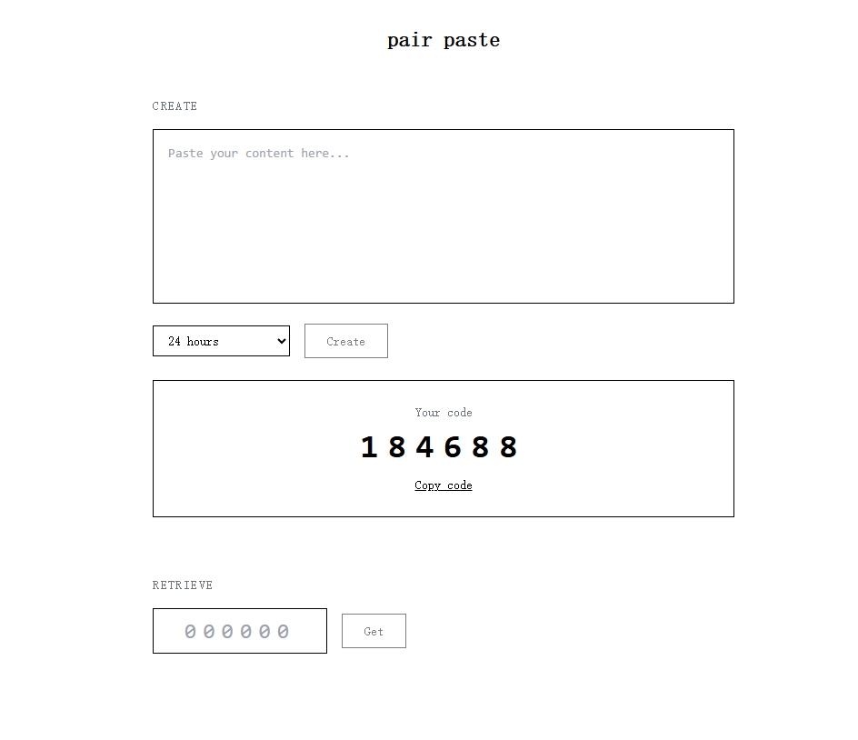
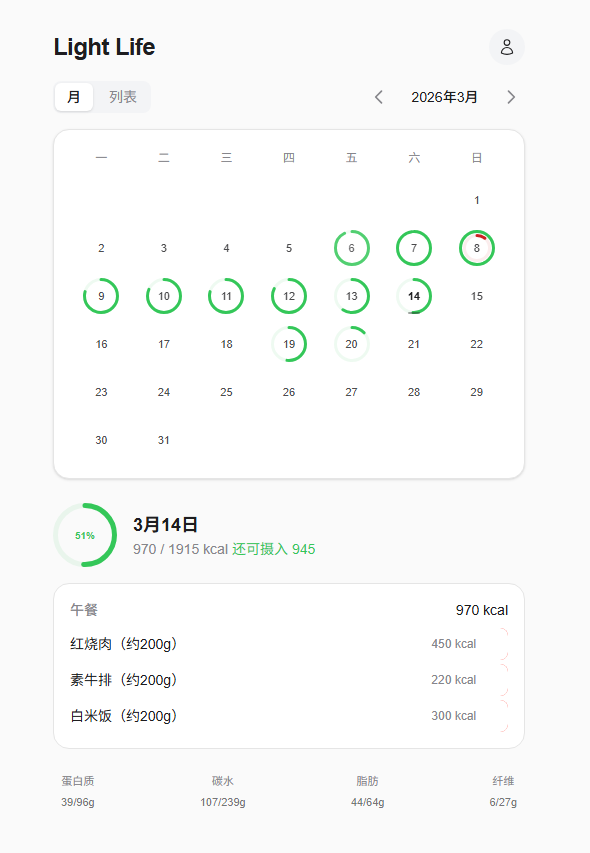
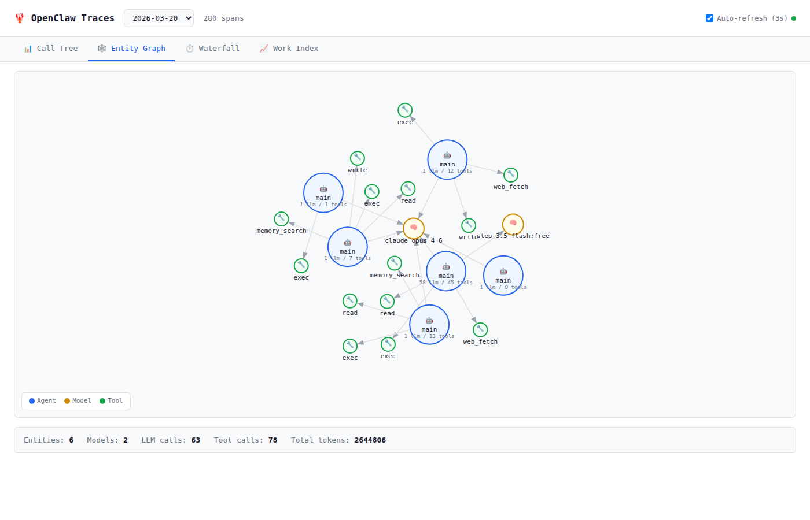
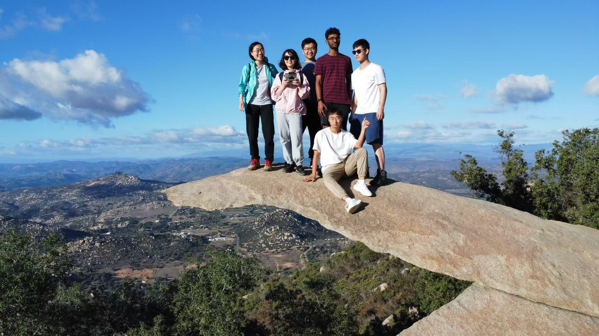
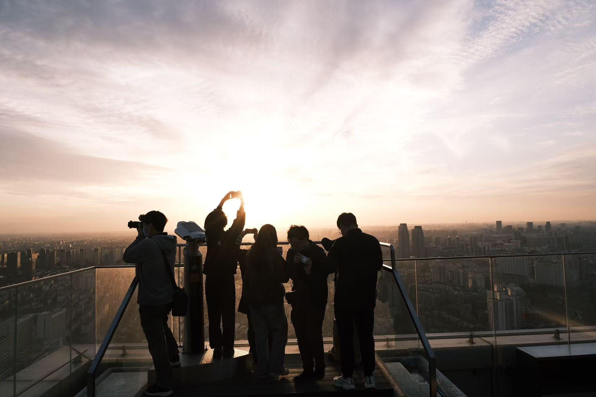
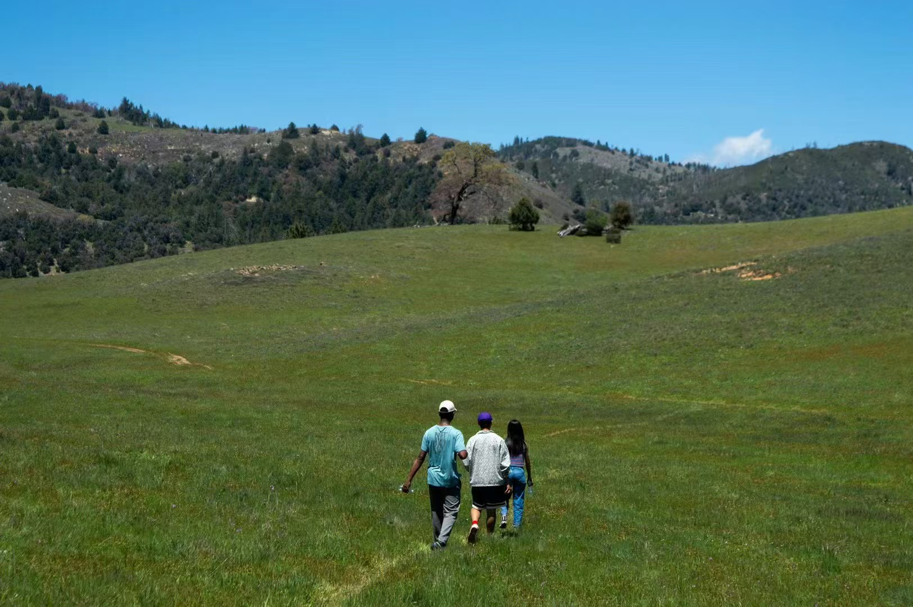
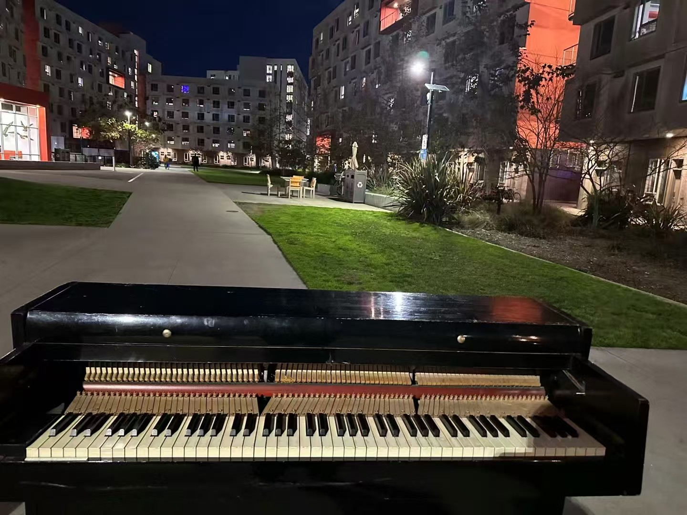
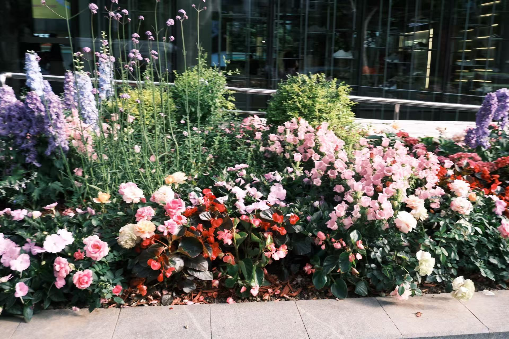
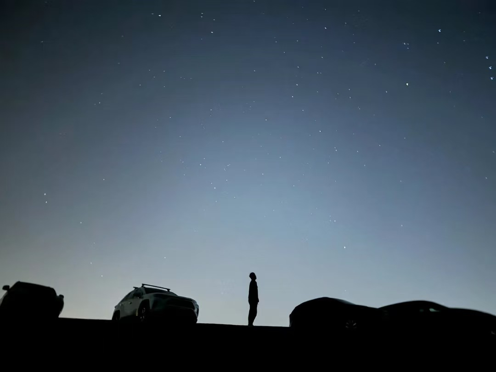
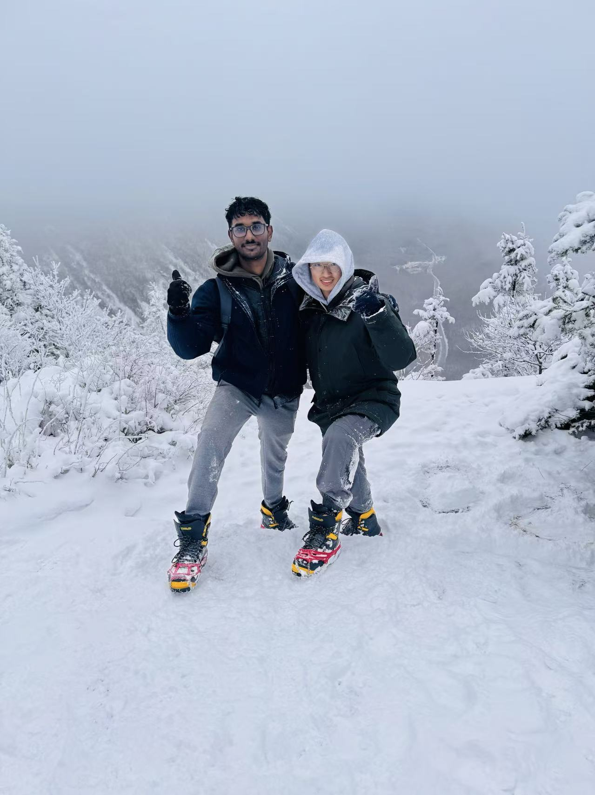

## About Me

Hi! I am Longxuan (Ted) Yu, a Ph.D. student (2025.09 -- ) in the <a href="https://www.cs.ucr.edu/">Department of Computer Science and Engineering</a> at the <a href="https://www.ucr.edu/">University of California, Riverside (UCR)</a>. My advisor is <a href="https://www.cs.ucr.edu/~gverstee/">Prof. Greg Ver Steeg</a>.  

Before joining UCR, I received my M.S. in Data Science from the <a href="https://ucsd.edu/">University of California, San Diego (UCSD)</a>, where I worked with <a href="https://www.haojianj.in/home.html">Prof. Haojian Jin</a> on trustworthy AI and generative models. I obtained my B.Eng. in Computer Science from <a href="https://en.hdu.edu.cn/">Hangzhou Dianzi University (HDU)</a>.

My current research interests lie in **Diffusion Models**, **Representation Learning**, and **Information-theoretic Methods**. I am particularly interested in the theoretical foundations of generative modeling, mutual information estimation, and how representation learning can support generalization across modalities and domains.  

If you want to know more about my research or potential collaborations, feel free to email me at **ylong030@ucr.edu**.  

---



## Academic Experience
- 2025.09 – present, Ph.D. Student, <a href="https://www.cs.ucr.edu/">Department of Computer Science and Engineering</a>, UCR  
  Advisor: <a href="https://www.cs.ucr.edu/~gverstee/">Prof. Greg Ver Steeg</a>
  Research Area: Diffusion models, Representation learning, Information-theoretic methods  
  

- 2023.09 – 2025.06, Research Assistant, <a href="https://datascience.ucsd.edu/">Halıcıoğlu Data Science Institute (HDSI)</a>, UCSD  
  Advisor: <a href="https://hao-jian.com/">Prof. Haojian Jin</a>  
  Project: *Moderator: Moderating Text-to-Image Diffusion Models through Fine-grained Context-based Policies*  
  Research Area: Diffusion-based generative modeling, Human-centered trustworthy AI  

## Education Experience
- 2025.09 – present, Ph.D., Computer Science, UCR, USA  
- 2023.09 – 2025.06, M.S., Data Science, UCSD, USA  
- 2019.09 – 2023.06, B.Eng., Computer Science, <a href="https://en.hdu.edu.cn/">Hangzhou Dianzi University (HDU)</a>, China  

## Honors and Awards
- 2024, **ACM CCS Distinguished Paper Award** (*Moderator: Moderating Text-to-Image Diffusion Models through Fine-grained Context-based Policies*)  
- 2023, Outstanding Graduate, Hangzhou Dianzi University  
- 2022, National Scholarship 

## Vibe Coding Products

Small tools I built with vibe coding. More to come!

  

    <a href="https://paste.lightsoul.xyz/" target="_blank">
      
      

        <h4>Pair Paste</h4>
        
Cross-device clipboard sharing via 6-digit codes. No login needed.

      

    </a>
  

  

    <a href="https://lightsoul.xyz/" target="_blank">
      
      

        <h4>LightSoul</h4>
        
Calorie tracking and diet logging app with daily nutrition breakdown.

      

    </a>
  

  

    <a href="https://fengsxy.github.io/openclaw-tracing/" target="_blank">
      
      

        <h4>OpenClaw Tracing</h4>
        
Full-stack observability for AI agents — call tree, entity graph, and SQL analytics.

      

    </a>
  

## Essay Blog

I keep a bilingual essay blog where I jot down research reflections and life notes.
- [Chinese version](https://fengsxy.github.io/essay/)
- [English version](https://fengsxy.github.io/essay/tag/en/)

<head>
    <meta charset="UTF-8">
    <meta name="viewport" content="width=device-width, initial-scale=1.0">
    <title>Gallery</title>
    

    
    <!--  -->

</head>
<body>
    <h2>Life Moments</h2>
    

        <!-- Each item in the gallery includes an image and a description -->
        

            
            
Coronado Beach

        

        

            
            
Potato Chip Rock

        

        

            
            
Shanghai Skyline

        

        

            
            
GF's Fried Rice

        

        

            
            
Hiking Trail

        

        

            
            
Hiking Trail

        

        

            
            
Hiking Overlook

        

        

            
            
Piano Practice

        

        

            
            
Blooming Flowers

        

        

            
            
Starry Night

        

        

            
            
White Mountain

        

         

            
            
La Jolla Sunset

        

    

</body>

